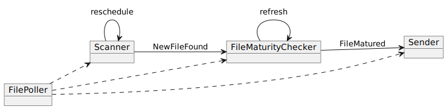

# file-poller

Proof of Concept project to pick file produced by other application. 
Main issue is that there is no explicit event that file is completed, so we can pick file that is still being produced.
Also, out-of-the-box file change notifications are not always available, for example when NSF is used.

Two approaches has been tried:

## Filter by LastModifiedDate

Idea is to use file's lastModificationDate, and just filter out files those are not mature enough.
Relies on file's `lastModificationDate` correspondence to `System.currentTimeMillis()`

Implementation: [LastModifiedDatePoller](src/main/java/org/kbabkin/filepoller/simple/LastModifiedDatePoller.java)

## Async processing by Akka Actors

Idea is to check that newly detected file is not modified for some time before using it.
Implementation is based on async processing library
[Akka Actors](https://doc.akka.io/docs/akka/current/typed/index.html),
it has light-weight and configurable threads model.

Implementation: [FilePoller](src/main/java/org/kbabkin/filepoller/actor/FilePoller.java) etc.

Actors Tree (- - ->) and Events (----->) :

Output from sample flow:  

    INFO  org.kbabkin.filepoller.actor.Scanner - New File found [/user/999-US/Scanner]: NIOFileInfo(path=target/test-data/scan/9123.txt)
    DEBUG org.kbabkin.filepoller.actor.Scanner - Reschedule [/user/999-US/Scanner]
    INFO  o.k.f.actor.FileMaturityChecker - Wait for file maturity [/user/999-US/FileMaturityChecker]: NIOFileInfo(path=target/test-data/scan/9123.txt)
    INFO  o.k.f.actor.FileMaturityChecker - File matured [/user/999-US/FileMaturityChecker]: NIOFileInfo(path=target/test-data/scan/9123.txt)
    INFO  org.kbabkin.filepoller.actor.Sender - SEND file (and RENAME) [/user/999-US/Sender]: FileMaturityChecker.FileMatured(super=FileCommand(fileInfo=NIOFileInfo(path=target/test-data/scan/9123.txt)))
